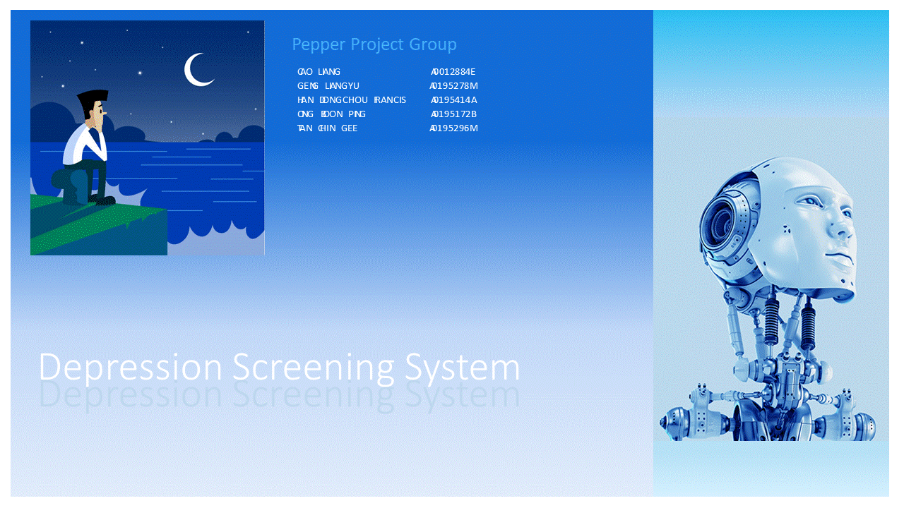

### Worksop Project Submission Template: Github Repository & Zip File

**[Naming Convention]** CourseCode-StartDate-BatchCode-Group_or_Individual-TeamName_or_PersonName-ProjectName.zip

* **[MTech Group Project Naming Example]** IRS-MR-2019-01-19-IS1PT-GRP-AwsomeSG-HDB_BTO_Recommender.zip

* **[MTech Individual Project Naming Example]** IRS-MR-2019-07-01-IS1FT-IND-SamGuZhan-HDB_BTO_Process.zip

* **[EEP Group Project Naming Example]** IRS-MR-2019-03-13-EEP-GRP-AwsomeSG-HDB_BTO_Recommender.zip

* **[EEP Individual Project Naming Example]** IRS-MR-2019-08-22-EEP-IND-SamGuZhan-HDB_BTO_Process.zip

[Online editor for this README.md markdown file](https://pandao.github.io/editor.md/en.html "pandao")

---

### <<<<<<<<<<<<<<<<<<<< Start of Template >>>>>>>>>>>>>>>>>>>>

---

## SECTION 1 : PROJECT TITLE
## Depression Screening System

---
## SECTION 2 : EXECUTIVE SUMMARY / PAPER ABSTRACT
One in four young Singaporeans show signs of depression. IMH treated 600 youths between 20 to 29-years-old last year alone.
And one out of four people admitted to suffering from multiple symptoms of depression in a recent survey of youths aged 18 to 25. The study was conducted by students from Wee Kim Wee School of Communication and Information in NTU.
We know that depression may lead to suicide. But other times, its sufferers become less productive and are more at risk for other diseases.
The latest statistics on depression don’t paint a pretty picture of progress but it shows that the condition is more common than we think. Yet the stigma surrounding it walls off the victim who often suffers in silence.
We need to seek out those who need help, and help them early. However, the challenge is that we do not have enough practitioners to do that.

This project serves to help Singapore tackle the immense problem of depression as well we alleviate the lack of practitioners to seek out those who need help. Using AI, we are trying to take a pro-active stand to detect depression condition in certain high-risk groups amongst the population, and as early on as possible.
We leveraged tools like KIE Workbench, the Spring Boot etc to put together a framework for the application.
This application can be used to seek out those who need professional assistance. With AI, we could apply some techniques like Certainty Factor, Decision Tree, and Inference Diagram to automate the screening of candidates. The screening is done at three levels:
1)	Identifying the high risk group – Risk Profiling
2)	Doing a 2-question survey (PHQ2)
3)	Doing a 7-question survey (PHQ9)
Level #1 can be applied to any organization, be it a school, a workplace, or even just targeting a segment of people.
Once level #1 is done, those identified candidates can proceed to Level #2 and level #3 in a survey setting so that we can ascertain whether the candidate would likely be suffering from depression, and then recommending the next steps.

---
## SECTION 3 : CREDITS / PROJECT CONTRIBUTION

| Official Full Name  | Student ID (MTech Applicable)  | Work Items (Who Did What) | Email (Optional) |
| :------------ |:---------------:| :-----| :-----|
| CAO LIANG            | A0012884E | xxxxxxxxxx yyyyyyyyyy zzzzzzzzzz| A0012884E@nus.edu.sg |
| GENG LIANGYU         | A0195278M | xxxxxxxxxx yyyyyyyyyy zzzzzzzzzz| A0195278M@nus.edu.sg |
| HAN DONGCHOU FRANCIS | A0195414A | xxxxxxxxxx yyyyyyyyyy zzzzzzzzzz| A0195414A@nus.edu.sg |
| ONG BOON PING        | A0195172B | xxxxxxxxxx yyyyyyyyyy zzzzzzzzzz| A0195172B@nus.edu.sg |
| TAN CHIN GEE         | A0195296M | xxxxxxxxxx yyyyyyyyyy zzzzzzzzzz| A0195296M@nus.edu.sg |

---
## SECTION 4 : VIDEO OF SYSTEM MODELLING & USE CASE DEMO

Note: It is not mandatory for every project member to appear in video presentation; Presentation by one project member is acceptable. 
More reference video presentations [here](https://telescopeuser.wordpress.com/2018/03/31/master-of-technology-solution-know-how-video-index-2/ "video presentations")

---
## SECTION 5 : USER GUIDE

`<Github File Link>` : <https://github.com/telescopeuser/Workshop-Project-Submission-Template/blob/master/UserGuide/User%20Guide%20HDB-BTO.pdf>

### [ 1 ] To run the system using iss-vm

> download pre-built virtual machine from http://bit.ly/iss-vm

> start iss-vm

> open terminal in iss-vm

> $ git clone https://github.com/telescopeuser/Workshop-Project-Submission-Template.git

> $ source activate iss-env-py2

> (iss-env-py2) $ cd Workshop-Project-Submission-Template/SystemCode/clips

> (iss-env-py2) $ python app.py

> **Go to URL using web browser** http://0.0.0.0:5000 or http://127.0.0.1:5000

### [ 2 ] To run the system in other/local machine:
### Install additional necessary libraries. This application works in python 2 only.

> $ sudo apt-get install python-clips clips build-essential libssl-dev libffi-dev python-dev python-pip

> $ pip install pyclips flask flask-socketio eventlet simplejson pandas

---
## SECTION 6 : PROJECT REPORT / PAPER

`<Github File Link>` : <https://github.com/telescopeuser/Workshop-Project-Submission-Template/blob/master/ProjectReport/Project%20Report%20HDB-BTO.pdf>

**Recommended Sections for Project Report / Paper:**
- Executive Summary / Paper Abstract
- Sponsor Company Introduction (if applicable)
- Business Problem Background
- Project Objectives & Success Measurements
- Project Solution (To detail domain modelling & system design.)
- Project Implementation (To detail system development & testing approach.)
- Project Performance & Validation (To prove project objectives are met.)
- Project Conclusions: Findings & Recommendation
- List of Abbreviations (if applicable)
- References (if applicable)

---
## SECTION 7 : MISCELLANEOUS

### DEFINITION OF DEPRESSION
Depression is a chronic illness often with episodes lasting months and high rates of relapses. It is known to cause the patient much suffering, the family distress and significantly increase the risk of suicide. Most people with depression will seek help from their family doctors. Sometimes, they present to the doctors with only physical symptoms such as headaches, chest pains or body ache. This form of presentation is particularly common in people with chronic illness as well as in teens and the elderly. As a result, depression can often be masked and the diagnosis of depression may be missed or disregarded.
Severe depression can be readily recognized but it may be difficult to distinguish milder form of depression from emotional changes associated with everyday life. Life stresses such as job loss, divorce, and the death of a loved one can result in a sad mood of short duration. Clinical depression or Major Depressive Disorder develops when depressed mood becomes much worse and persistent and is accompanied by other symptoms and lasts for more than two weeks. When depressed, a person may start to have difficulties with his sleep. He feels unmotivated and will no longer be interested in his work and the usual things he liked. He can also have problems with his appetite and weight. When performing activities, he has little energy and cannot concentrate. He may feel guilty about things he has done wrong and ruminate excessively about the past. When the depression becomes more severe, he will feel that life is hopeless and may contemplate or even attempt suicide. Patients tell us that when they are suffering from Major Depressive Disorder, it is like wearing a pair of shades that cannot be removed and everything looks dark and gloomy

---

### <<<<<<<<<<<<<<<<<<<< End of Template >>>>>>>>>>>>>>>>>>>>

---

**This [Machine Reasoning (MR)](https://www.iss.nus.edu.sg/executive-education/course/detail/machine-reasoning "Machine Reasoning") course is part of the Analytics and Intelligent Systems and Graduate Certificate in [Intelligent Reasoning Systems (IRS)](https://www.iss.nus.edu.sg/stackable-certificate-programmes/intelligent-systems "Intelligent Reasoning Systems") series offered by [NUS-ISS](https://www.iss.nus.edu.sg "Institute of Systems Science, National University of Singapore").**

**Lecturer: [GU Zhan (Sam)](https://www.iss.nus.edu.sg/about-us/staff/detail/201/GU%20Zhan "GU Zhan (Sam)")**

**zhan.gu@nus.edu.sg**
